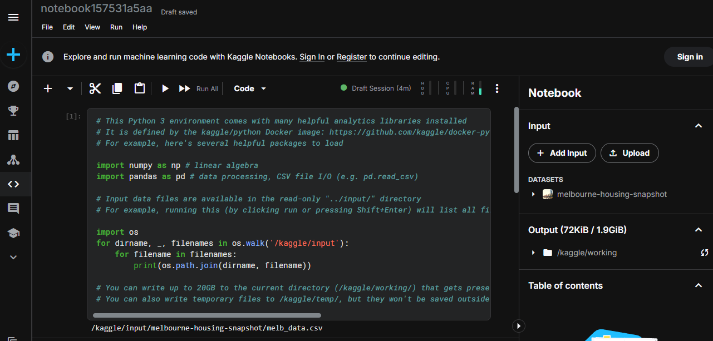
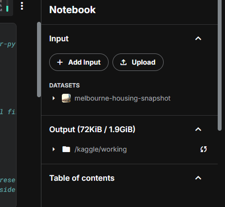
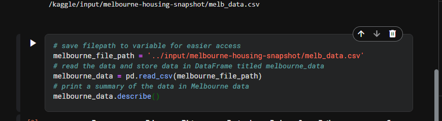
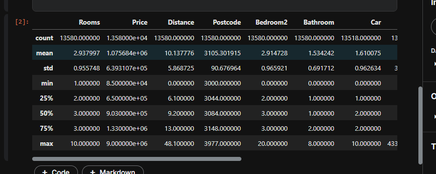

### Using Pandas to Get Familiar With Your Data
The first step in any machine learning project is familiarize yourself with the data. You'll use the Pandas library for this. Pandas is the primary tool data scientists use for exploring and manipulating data. Most people abbreviate pandas in their code as pd. We do this with the command

### import pandas as pd

The most important part of the Pandas library is the DataFrame. A DataFrame holds the type of data you might think of as a table. This is similar to a sheet in Excel, or a table in a SQL database.

Pandas has powerful methods for most things you'll want to do with this type of data.

### Notebook process 

* run the command as it is
* make sure to add input then "dataset" and search the "melbourne-housing-snapshot"

* then run the following command 

* then you should see the following table 

### Interpreting Data Description¶
The results show 8 numbers for each column in your original dataset. The first number, the count, shows how many rows have non-missing values.

Missing values arise for many reasons. For example, the size of the 2nd bedroom wouldn't be collected when surveying a 1 bedroom house. We'll come back to the topic of missing data.

The second value is the mean, which is the average. Under that, std is the standard deviation, which measures how numerically spread out the values are.

To interpret the min, 25%, 50%, 75% and max values, imagine sorting each column from lowest to highest value. The first (smallest) value is the min. If you go a quarter way through the list, you'll find a number that is bigger than 25% of the values and smaller than 75% of the values. That is the 25% value (pronounced "25th percentile"). The 50th and 75th percentiles are defined analogously, and the max is the largest number

