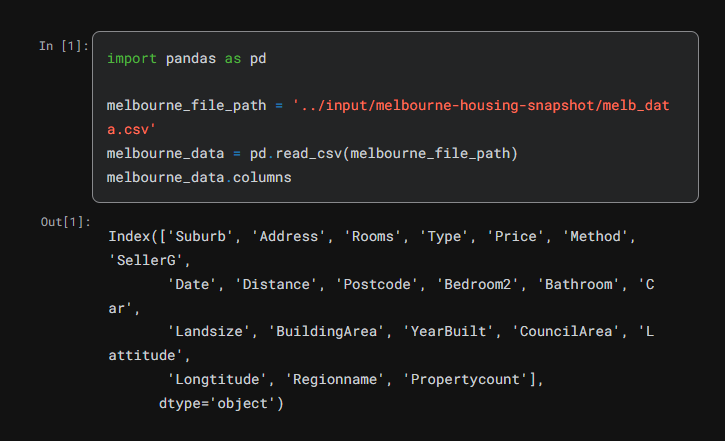
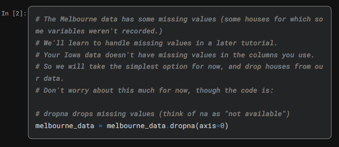
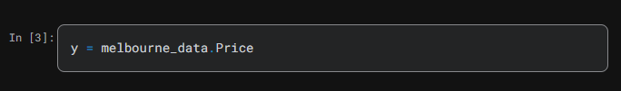
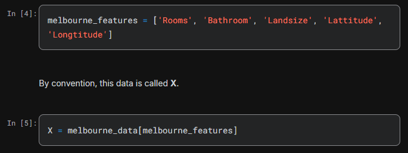
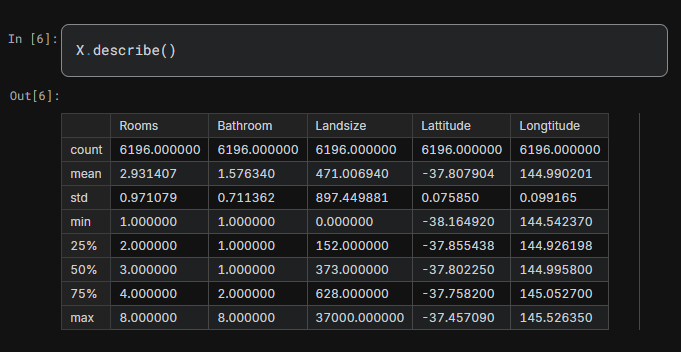
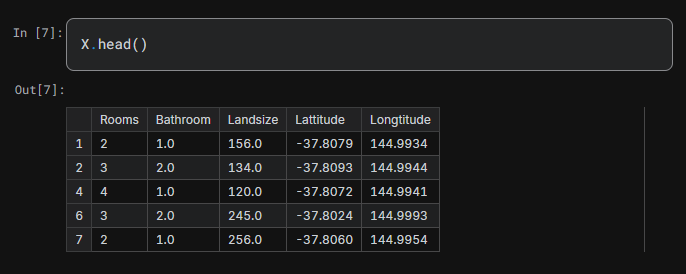
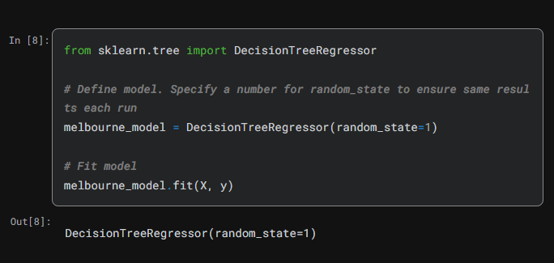
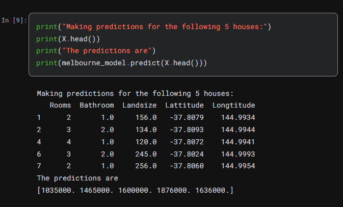

### Selecting Data for Modeling
Your dataset had too many variables to wrap your head around, or even to print out nicely. How can you pare down this overwhelming amount of data to something you can understand?

We'll start by picking a few variables using our intuition. Later courses will show you statistical techniques to automatically prioritize variables.

To choose variables/columns, we'll need to see a list of all columns in the dataset. That is done with the columns property of the DataFrame (the bottom line of code below).

There are many ways to select a subset of your data. The Pandas course covers these in more depth, but we will focus on two approaches for now.

* Dot notation, which we use to select the "prediction target"
* Selecting with a column list, which we use to select the "features"

### Selecting The Prediction Target¶
You can pull out a variable with dot-notation. This single column is stored in a Series, which is broadly like a DataFrame with only a single column of data.

We'll use the dot notation to select the column we want to predict, which is called the prediction target. By convention, the prediction target is called y. So the code we need to save the house prices in the Melbourne data is

### Choosing "Features"¶
The columns that are inputted into our model (and later used to make predictions) are called "features." In our case, those would be the columns used to determine the home price. Sometimes, you will use all columns except the target as features. Other times you'll be better off with fewer features.

For now, we'll build a model with only a few features. Later on you'll see how to iterate and compare models built with different features.

We select multiple features by providing a list of column names inside brackets. Each item in that list should be a string (with quotes).

Here is an example:

Let's quickly review the data we'll be using to predict house prices using the describe method and the head method, which shows the top few rows.

Visually checking your data with these commands is an important part of a data scientist's job. You'll frequently find surprises in the dataset that deserve further inspection.

### Building Your Model¶
You will use the scikit-learn library to create your models. When coding, this library is written as sklearn, as you will see in the sample code. Scikit-learn is easily the most popular library for modeling the types of data typically stored in DataFrames.

The steps to building and using a model are:

* Define: What type of model will it be? A decision tree? Some other type of model? Some other parameters of the model type are specified too.
* Fit: Capture patterns from provided data. This is the heart of modeling.
* Predict: Just what it sounds like
* Evaluate: Determine how accurate the model's predictions are.
Here is an example of defining a decision tree model with scikit-learn and fitting it with the features and target variable.

Many machine learning models allow some randomness in model training. Specifying a number for random_state ensures you get the same results in each run. This is considered a good practice. You use any number, and model quality won't depend meaningfully on exactly what value you choose.

We now have a fitted model that we can use to make predictions.

In practice, you'll want to make predictions for new houses coming on the market rather than the houses we already have prices for. But we'll make predictions for the first few rows of the training data to see how the predict function works.

