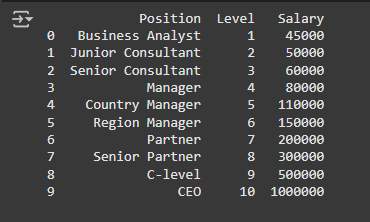
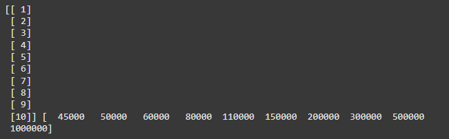
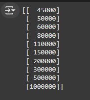
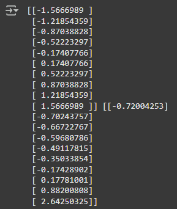
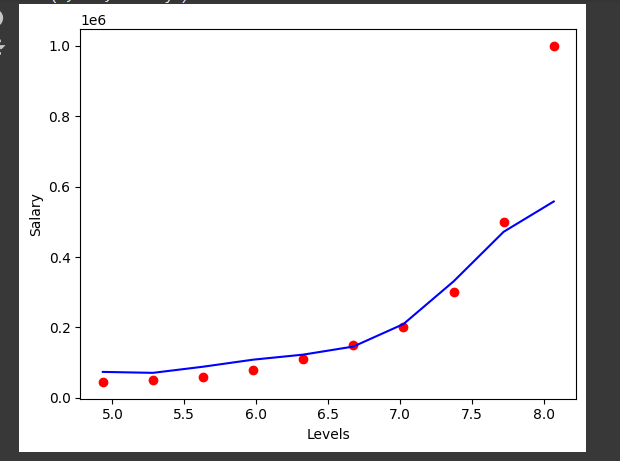
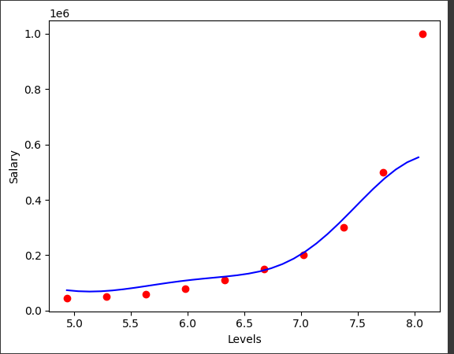

import pandas as pd

import numpy as np

import matplotlib.pyplot as plt

df = pd.read_csv('Position_Salaries.csv')

print(df)

X = df.iloc[:, 1:-1].values

y = df.iloc[:, -1].values

print(X,y)

* but since Featuers scaling needs our arrays to be 2D , meaning y will give an error so we have to reshape it

y = y.reshape(-1, 1) 

* or can use ( len(y) , 1 ) meaning rows of y length and one column

print(y)

adding the features scaling beacuse we don't want this feature which takes values much lower than the values of the dependent variable to be neglected by SVR model though we will inverse it later too

* Features Scaling

from sklearn.preprocessing import StandardScaler

sc_X = StandardScaler()

sc_y = StandardScaler()

X = sc_X.fit_transform(X)

y = sc_y.fit_transform(y)

print(X,y)

* training the SVR model

from sklearn.svm import SVR

regressor = SVR(kernel = 'rbf')

regressor.fit(X,y)

prediction = regressor.predict(sc_X.transform([[6.5]]))

print(prediction)

* but this gives [-0.41686141] cos of scaler so we need to inverse it

sc_y.inverse_transform([prediction]).reshape(-1,1)

* we added reshape to be extra sure

array([[131106.77303274]])

sc_y.inverse_transform(regressor.predict(sc_X.transform([[6.5]])).reshape(-1, 1))

* this is a shortcut and valid too

plt.scatter(sc_X.inverse_transform(X),sc_y.inverse_transform(y),color="red")

plt.plot(sc_X.inverse_transform(X), sc_y.inverse_transform(regressor.predict(X).reshape(-1,1)), color="blue" )

plt.xlabel('Levels')

plt.ylabel('Salary')

* now we gonna make it smooth

X_grid = np.arange(min(sc_X.inverse_transform(X)), max(sc_X.inverse_transform(X)), 0.1).reshape(-1,1)

plt.scatter(sc_X.inverse_transform(X),sc_y.inverse_transform(y),color="red")

plt.plot(X_grid, sc_y.inverse_transform(regressor.predict(sc_X.transform(X_grid)).reshape(-1,1)), color="blue" )

plt.xlabel('Levels')

plt.ylabel('Salary')

