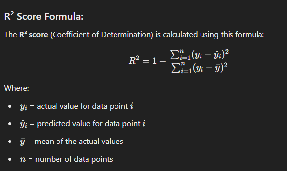
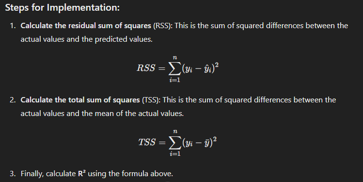

R² Score Interpretation:
1: Perfect Model
The model perfectly predicts the data with no error. It’s a rare, "too good to be true" case, often a sign of overfitting.

0.9 - 1: Very Good
The model explains 90-100% of the variance in the data. This indicates a very good fit, but you still want to be cautious of overfitting (especially as it approaches 1).

0.7 - 0.9: Good
The model explains 70-90% of the variance. It’s performing well and making reasonably accurate predictions.

0.5 - 0.7: Moderate
The model explains 50-70% of the variance. It’s not bad but there’s room for improvement.

0 - 0.5: Poor
The model only explains 0-50% of the variance. There’s likely significant room for improvement, and the model might not be generalizing well to the data.

Negative Values: Very Poor
A negative R² score indicates that the model performs worse than a simple horizontal line (predicting the mean of the target values). It means the model’s predictions are worse than simply guessing the mean of the target variable.

### Example Breakdown:
* R² = 0.95: Very Good – The model is a great fit.
* R² = 0.6: Moderate – It’s okay, but could be improved.
* R² = -0.2: Very Poor – The model is worse than guessing the mean.

### formula 

