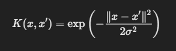

### What is the Gaussian RBF Kernel?
The Gaussian Radial Basis Function (RBF) kernel is a function used to compute the similarity between two data points. In simple terms, it helps measure how close or similar two points are in your dataset.

Mathematically, it’s defined as:

Where:

* 𝑥
x and 
𝑥
′
x 
′
  are two data points.
* ∥
𝑥
−
𝑥
′
∥
∥x−x 
′
 ∥ is the Euclidean distance between the points 
𝑥
x and 
𝑥
′
x 
′
 .
* 𝜎
σ (sigma) is a parameter that controls the width of the "influence" of a single training point.

The kernel gives a high value when two points are close to each other and a low value when they are far apart. Essentially, it’s like Miya sitting closer to you when she wants a treat 🐱🍖 and sitting further away when she’s feeling lazy.

### How Does the Gaussian RBF Kernel Work in SVM?

In SVM with RBF kernel (SVC(kernel='rbf')), the kernel measures the similarity between data points and transforms the data into a higher-dimensional space where it becomes easier to find a separating hyperplane. Think of it as "bending" the space to separate data that wasn’t linearly separable in its original form.

So, when you set kernel='rbf' in SVC, you're telling the model to use this Gaussian RBF kernel for the transformation. This means:

* Close points will have high similarity (closer to each other).
* Far apart points will have low similarity (further apart).

