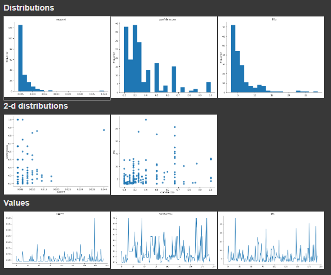

The Apriori algorithm is a popular algorithm used for association rule learning in data mining. It's primarily used to find frequent itemsets in transactional data (like your market basket data), and from those itemsets, generate association rules that show how products are likely to be bought together.

For example, the Apriori algorithm might tell you something like:

* Rule: If a customer buys item A, they are likely to also buy item B.
* Support: How frequently the rule occurs.
* Confidence: The likelihood of the rule happening.
* Lift: How much more likely item B is bought when item A is bought compared to item B being bought by itself.

### #Displaying the results with Pandas

### sorted on base of lifts

