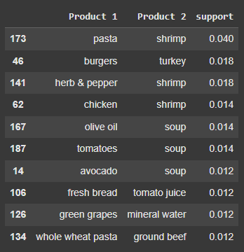

### sorted with Eclat on support only 

* Eclat is often preferred for datasets where the number of transactions is large but the number of unique items is small.
* Apriori is simpler and more intuitive, making it a good starting point for understanding association rules.

