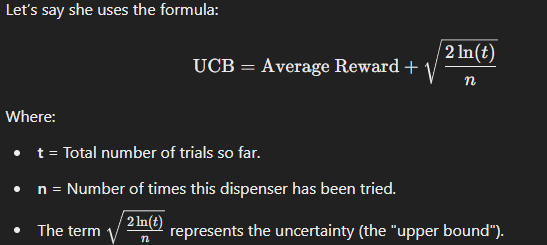

### Example: Miya and the Upper Confidence Bound (UCB) Strategy 🐾🍖
Miya is still trying to figure out which of the three treat dispensers gives her the most delicious treats. However, instead of randomly exploring or exploiting based on past experience, Miya uses the Upper Confidence Bound (UCB) strategy to decide which dispenser to choose next.

### The Setup:
* Dispenser 1 gives Miya a treat 70% of the time.
* Dispenser 2 gives Miya a treat 50% of the time.
* Dispenser 3 gives Miya a treat 30% of the time.
### UCB Strategy:
The idea behind UCB is to combine the average reward of each dispenser with how uncertain we are about its reward. Miya will choose the dispenser that has the highest upper confidence bound (which balances both the observed reward and how much she still doesn't know).

### For each dispenser, UCB will calculate a value:

* A dispenser with a high average reward will have a high value, but...
* A dispenser that has been tried less often will have a higher uncertainty and thus a higher UCB value, which encourages Miya to explore it more.
This strategy will help Miya explore the less tried dispensers while still favoring the ones that give the best rewards.

### The Process (How UCB Works):
1. Initial Exploration: Miya starts by trying all dispensers a few times (this gives her some basic data).

Let’s say Miya tries Dispenser 1, Dispenser 2, and Dispenser 3 once each. After one trial, she has:
* Dispenser 1: 1 treat
* Dispenser 2: 0 treats
* Dispenser 3: 1 treat

2. Confidence Calculations: After these initial trials, Miya now calculates the confidence bounds for each dispenser. She takes the average reward (treats per trial) and adds a term that represents her uncertainty—this term gets smaller as she tries a dispenser more and larger if she hasn’t explored it as much.

### Let’s say she uses the formula:

 
Choosing the Best Dispenser: Based on the calculations, Miya will select the dispenser with the highest UCB value. This means if Dispenser 3 hasn't been tried much, it might still get a high UCB value because of the uncertainty, even though it has a lower average reward.

* Exploit and Explore: As Miya keeps exploring and getting more data, the confidence bounds shrink and the strategy shifts more toward exploitation (choosing the dispenser with the best average reward), but it still balances with occasional exploration of the less-tried dispensers.

### The Goal:
Miya uses the UCB strategy to explore the dispensers in such a way that she maximizes the number of treats over time, while still being careful to explore the less-tried dispensers to ensure she doesn't miss out on any hidden gems.

This strategy is more efficient than simple random exploration because Miya uses both her experience and uncertainty to decide which dispenser to try next. Over time, she will increasingly focus on the dispenser that gives her the most treats, but she’ll still keep an eye on the others just in case. 😼🍖
