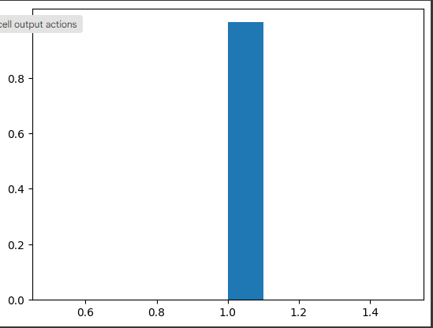

### visualisatoin

### How Thompson Sampling different from UCB

🐱 Miya and the Mysterious Treat Bowls

Imagine Miya has three bowls with treats 🍖, but she doesn’t know which bowl gives the most treats. She can either:

* Explore (try different bowls to learn more).
* Exploit (stick with the bowl she thinks is best).
* Thompson Sampling (TS) and Upper Confidence Bound (UCB) solve this problem in different ways.

🔵 Upper Confidence Bound (UCB) – Play It Safe
💡 "I'll go for the bowl that seems best but also check others occasionally."

UCB assumes that less-explored options might be better and selects the ad (or action) based on:

UCB = Mean Reward + Confidence Term

### where:

* Mean Reward = Average success rate so far.
* Confidence Term = A bonus that shrinks as an option is explored more.

### Steps:

1. Start by trying every option at least once.
2. Pick the option with the highest UCB score.
3. Update the rewards and confidence.
4. Over time, UCB reduces exploration and focuses on the best option.
🔹 Good for: Well-balanced exploration & exploitation.
🔹 Weakness: Assumes rewards are deterministic and can take longer to adapt.

### Miya's UCB Strategy:
If Miya got 3 treats from Bowl A and 2 from Bowl B, she might still try Bowl B sometimes just to make sure it’s not better.

🔴 Thompson Sampling (TS) – Probability-Based Exploration

💡 "I'll guess the best bowl based on past results, but keep testing others randomly."

TS models the uncertainty of each option using a probability distribution (Beta distribution) and selects the ad randomly from these distributions.

### Steps:

1. Each option starts with a Beta distribution (uncertain belief).
2. Sample a random value for each option from its distribution.
3. Choose the option with the highest sampled value.
4. Update the distribution based on success/failure.
5. Over time, TS automatically balances exploration & exploitation.
🔹 Good for: Uncertain environments, faster learning.
🔹 Weakness: Needs probability modeling (Bayesian approach).

### Miya's TS Strategy:

If Bowl A has a 75% success rate and Bowl B has 40%, she'll mostly pick A but sometimes randomly test B to be sure.
